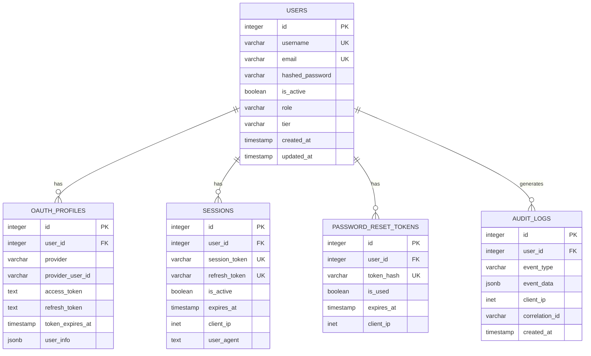
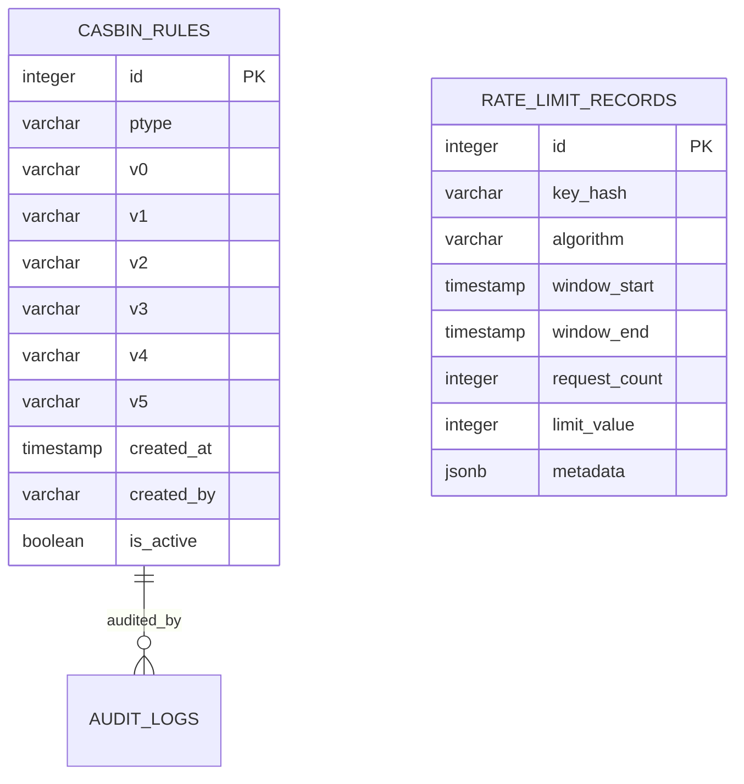

# Database Design

This document describes the database design for Cedrina, including the schema, relationships, and design decisions that follow Domain-Driven Design principles.

## Database Overview

Cedrina uses PostgreSQL as the primary database with the following design principles:

- **Domain-Driven Design**: Database schema reflects domain entities and aggregates
- **Clean Architecture**: Database is part of the infrastructure layer
- **Type Safety**: SQLModel provides type-safe database operations
- **Migration Management**: Alembic handles schema evolution
- **Connection Pooling**: Optimized for high-performance applications

## Database Schema

### Core Tables

#### Users Table

The central entity representing application users with comprehensive profile information.

```sql
CREATE TABLE users (
    id SERIAL PRIMARY KEY,
    username VARCHAR(50) UNIQUE NOT NULL,
    email VARCHAR(254) UNIQUE NOT NULL,
    hashed_password VARCHAR(255) NOT NULL,
    is_active BOOLEAN DEFAULT TRUE,
    is_verified BOOLEAN DEFAULT FALSE,
    role VARCHAR(20) DEFAULT 'USER',
    tier VARCHAR(20) DEFAULT 'FREE',
    created_at TIMESTAMP WITH TIME ZONE DEFAULT NOW(),
    updated_at TIMESTAMP WITH TIME ZONE DEFAULT NOW(),
    last_login_at TIMESTAMP WITH TIME ZONE,
    failed_login_attempts INTEGER DEFAULT 0,
    locked_until TIMESTAMP WITH TIME ZONE,
    password_changed_at TIMESTAMP WITH TIME ZONE DEFAULT NOW(),
    email_verified_at TIMESTAMP WITH TIME ZONE,
    profile_data JSONB,
    preferences JSONB DEFAULT '{}',
    metadata JSONB DEFAULT '{}'
);
```

**Indexes:**
```sql
CREATE INDEX idx_users_username ON users(username);
CREATE INDEX idx_users_email ON users(email);
CREATE INDEX idx_users_role ON users(role);
CREATE INDEX idx_users_tier ON users(tier);
CREATE INDEX idx_users_is_active ON users(is_active);
CREATE INDEX idx_users_created_at ON users(created_at);
```

#### OAuth Profiles Table

Stores OAuth provider information for users who authenticate via external providers.

```sql
CREATE TABLE oauth_profiles (
    id SERIAL PRIMARY KEY,
    user_id INTEGER NOT NULL REFERENCES users(id) ON DELETE CASCADE,
    provider VARCHAR(50) NOT NULL,
    provider_user_id VARCHAR(255) NOT NULL,
    access_token TEXT,
    refresh_token TEXT,
    token_expires_at TIMESTAMP WITH TIME ZONE,
    user_info JSONB,
    created_at TIMESTAMP WITH TIME ZONE DEFAULT NOW(),
    updated_at TIMESTAMP WITH TIME ZONE DEFAULT NOW(),
    UNIQUE(provider, provider_user_id),
    UNIQUE(user_id, provider)
);
```

**Indexes:**
```sql
CREATE INDEX idx_oauth_profiles_user_id ON oauth_profiles(user_id);
CREATE INDEX idx_oauth_profiles_provider ON oauth_profiles(provider);
CREATE INDEX idx_oauth_profiles_provider_user_id ON oauth_profiles(provider_user_id);
```

#### Sessions Table

Manages user sessions for authentication and security tracking.

```sql
CREATE TABLE sessions (
    id SERIAL PRIMARY KEY,
    user_id INTEGER NOT NULL REFERENCES users(id) ON DELETE CASCADE,
    session_token VARCHAR(255) UNIQUE NOT NULL,
    refresh_token VARCHAR(255) UNIQUE NOT NULL,
    is_active BOOLEAN DEFAULT TRUE,
    created_at TIMESTAMP WITH TIME ZONE DEFAULT NOW(),
    expires_at TIMESTAMP WITH TIME ZONE NOT NULL,
    last_activity_at TIMESTAMP WITH TIME ZONE DEFAULT NOW(),
    client_ip INET,
    user_agent TEXT,
    device_info JSONB,
    security_context JSONB DEFAULT '{}'
);
```

**Indexes:**
```sql
CREATE INDEX idx_sessions_user_id ON sessions(user_id);
CREATE INDEX idx_sessions_session_token ON sessions(session_token);
CREATE INDEX idx_sessions_refresh_token ON sessions(refresh_token);
CREATE INDEX idx_sessions_is_active ON sessions(is_active);
CREATE INDEX idx_sessions_expires_at ON sessions(expires_at);
```

#### Password Reset Tokens Table

Manages password reset tokens with security features and expiration.

```sql
CREATE TABLE password_reset_tokens (
    id SERIAL PRIMARY KEY,
    user_id INTEGER NOT NULL REFERENCES users(id) ON DELETE CASCADE,
    token_hash VARCHAR(255) UNIQUE NOT NULL,
    is_used BOOLEAN DEFAULT FALSE,
    created_at TIMESTAMP WITH TIME ZONE DEFAULT NOW(),
    expires_at TIMESTAMP WITH TIME ZONE NOT NULL,
    used_at TIMESTAMP WITH TIME ZONE,
    client_ip INET,
    user_agent TEXT,
    security_context JSONB DEFAULT '{}'
);
```

**Indexes:**
```sql
CREATE INDEX idx_password_reset_tokens_user_id ON password_reset_tokens(user_id);
CREATE INDEX idx_password_reset_tokens_token_hash ON password_reset_tokens(token_hash);
CREATE INDEX idx_password_reset_tokens_is_used ON password_reset_tokens(is_used);
CREATE INDEX idx_password_reset_tokens_expires_at ON password_reset_tokens(expires_at);
```

### Security Tables

#### Casbin Rules Table

Implements role-based access control (RBAC) and attribute-based access control (ABAC).

```sql
CREATE TABLE casbin_rules (
    id SERIAL PRIMARY KEY,
    ptype VARCHAR(10) NOT NULL,
    v0 VARCHAR(256),
    v1 VARCHAR(256),
    v2 VARCHAR(256),
    v3 VARCHAR(256),
    v4 VARCHAR(256),
    v5 VARCHAR(256),
    created_at TIMESTAMP WITH TIME ZONE DEFAULT NOW(),
    updated_at TIMESTAMP WITH TIME ZONE DEFAULT NOW(),
    created_by VARCHAR(100),
    updated_by VARCHAR(100),
    is_active BOOLEAN DEFAULT TRUE
);
```

**Indexes:**
```sql
CREATE INDEX idx_casbin_rules_ptype ON casbin_rules(ptype);
CREATE INDEX idx_casbin_rules_v0 ON casbin_rules(v0);
CREATE INDEX idx_casbin_rules_v1 ON casbin_rules(v1);
CREATE INDEX idx_casbin_rules_is_active ON casbin_rules(is_active);
```

#### Audit Logs Table

Comprehensive audit trail for security events and user actions.

```sql
CREATE TABLE audit_logs (
    id SERIAL PRIMARY KEY,
    user_id INTEGER REFERENCES users(id) ON DELETE SET NULL,
    event_type VARCHAR(100) NOT NULL,
    event_data JSONB NOT NULL,
    client_ip INET,
    user_agent TEXT,
    correlation_id VARCHAR(100),
    created_at TIMESTAMP WITH TIME ZONE DEFAULT NOW(),
    severity VARCHAR(20) DEFAULT 'INFO',
    source VARCHAR(100),
    metadata JSONB DEFAULT '{}'
);
```

**Indexes:**
```sql
CREATE INDEX idx_audit_logs_user_id ON audit_logs(user_id);
CREATE INDEX idx_audit_logs_event_type ON audit_logs(event_type);
CREATE INDEX idx_audit_logs_created_at ON audit_logs(created_at);
CREATE INDEX idx_audit_logs_correlation_id ON audit_logs(correlation_id);
CREATE INDEX idx_audit_logs_severity ON audit_logs(severity);
```

### Rate Limiting Tables

#### Rate Limit Records Table

Tracks rate limiting data for different algorithms and policies.

```sql
CREATE TABLE rate_limit_records (
    id SERIAL PRIMARY KEY,
    key_hash VARCHAR(255) NOT NULL,
    algorithm VARCHAR(50) NOT NULL,
    window_start TIMESTAMP WITH TIME ZONE NOT NULL,
    window_end TIMESTAMP WITH TIME ZONE NOT NULL,
    request_count INTEGER DEFAULT 1,
    limit_value INTEGER NOT NULL,
    metadata JSONB DEFAULT '{}',
    created_at TIMESTAMP WITH TIME ZONE DEFAULT NOW(),
    updated_at TIMESTAMP WITH TIME ZONE DEFAULT NOW(),
    UNIQUE(key_hash, algorithm, window_start)
);
```

**Indexes:**
```sql
CREATE INDEX idx_rate_limit_records_key_hash ON rate_limit_records(key_hash);
CREATE INDEX idx_rate_limit_records_algorithm ON rate_limit_records(algorithm);
CREATE INDEX idx_rate_limit_records_window_start ON rate_limit_records(window_start);
CREATE INDEX idx_rate_limit_records_window_end ON rate_limit_records(window_end);
```

## Entity Relationships

### User Relationships



### Security Relationships



## Domain Models

### User Entity

```python
@dataclass
class User:
    """User domain entity following DDD principles."""
    
    id: Optional[int]
    username: Username
    email: Email
    hashed_password: HashedPassword
    is_active: bool = True
    is_verified: bool = False
    role: Role = Role.USER
    tier: UserTier = UserTier.FREE
    created_at: datetime = field(default_factory=datetime.utcnow)
    updated_at: datetime = field(default_factory=datetime.utcnow)
    last_login_at: Optional[datetime] = None
    failed_login_attempts: int = 0
    locked_until: Optional[datetime] = None
    password_changed_at: datetime = field(default_factory=datetime.utcnow)
    email_verified_at: Optional[datetime] = None
    profile_data: Dict[str, Any] = field(default_factory=dict)
    preferences: Dict[str, Any] = field(default_factory=dict)
    metadata: Dict[str, Any] = field(default_factory=dict)
```

### Session Entity

```python
@dataclass
class Session:
    """Session domain entity for authentication management."""
    
    id: Optional[int]
    user_id: int
    session_token: str
    refresh_token: str
    is_active: bool = True
    created_at: datetime = field(default_factory=datetime.utcnow)
    expires_at: datetime
    last_activity_at: datetime = field(default_factory=datetime.utcnow)
    client_ip: Optional[str] = None
    user_agent: Optional[str] = None
    device_info: Dict[str, Any] = field(default_factory=dict)
    security_context: Dict[str, Any] = field(default_factory=dict)
```

## Database Migrations

### Migration Strategy

Cedrina uses Alembic for database migrations with the following strategy:

1. **Version Control**: All schema changes are versioned
2. **Rollback Support**: Migrations can be rolled back safely
3. **Data Preservation**: Migrations preserve existing data
4. **Environment Consistency**: Same schema across all environments

### Migration Commands

```bash
# Create a new migration
alembic revision --autogenerate -m "Add new table"

# Apply migrations
alembic upgrade head

# Rollback migrations
alembic downgrade -1

# Check migration status
alembic current
alembic history
```

### Example Migration

```python
"""Add user preferences table

Revision ID: 123456789abc
Revises: previous_revision
Create Date: 2024-01-01 12:00:00.000000

"""
from alembic import op
import sqlalchemy as sa
from sqlalchemy.dialects import postgresql

def upgrade():
    # Add preferences column to users table
    op.add_column('users', sa.Column('preferences', postgresql.JSONB(), nullable=True))
    
    # Create index for efficient querying
    op.create_index('idx_users_preferences', 'users', ['preferences'], postgresql_using='gin')

def downgrade():
    # Remove index
    op.drop_index('idx_users_preferences', table_name='users')
    
    # Remove column
    op.drop_column('users', 'preferences')
```

## Performance Optimization

### Indexing Strategy

1. **Primary Keys**: All tables have auto-incrementing primary keys
2. **Unique Constraints**: Username, email, and tokens have unique indexes
3. **Foreign Keys**: All foreign keys are indexed for join performance
4. **Composite Indexes**: Multi-column indexes for complex queries
5. **Partial Indexes**: Indexes on active records only where appropriate

### Query Optimization

```sql
-- Optimized user lookup with role and tier
SELECT id, username, email, role, tier, is_active
FROM users 
WHERE username = $1 AND is_active = true;

-- Efficient session cleanup
DELETE FROM sessions 
WHERE expires_at < NOW() AND is_active = true;

-- Fast audit log queries with time range
SELECT event_type, event_data, created_at
FROM audit_logs 
WHERE user_id = $1 
  AND created_at >= $2 
  AND created_at <= $3
ORDER BY created_at DESC;
```

### Connection Pooling

```python
# Database connection pool configuration
DATABASE_POOL_SIZE = 20
DATABASE_MAX_OVERFLOW = 30
DATABASE_POOL_TIMEOUT = 30
DATABASE_POOL_RECYCLE = 3600
```

## Security Considerations

### Data Protection

1. **Password Hashing**: Bcrypt with configurable rounds
2. **Token Security**: Cryptographically secure tokens
3. **Input Validation**: SQL injection prevention
4. **Access Control**: Row-level security where appropriate
5. **Audit Trails**: Comprehensive logging of all changes

### Privacy Compliance

1. **Data Minimization**: Only store necessary data
2. **Right to Deletion**: Support for data deletion requests
3. **Data Encryption**: Sensitive data encryption at rest
4. **Access Logging**: Track all data access
5. **Consent Management**: User consent tracking

## Backup and Recovery

### Backup Strategy

```bash
# Database backup
pg_dump -h localhost -U username -d cedrina > backup.sql

# Automated backup script
#!/bin/bash
BACKUP_DIR="/backups"
DATE=$(date +%Y%m%d_%H%M%S)
pg_dump -h $DB_HOST -U $DB_USER -d $DB_NAME > $BACKUP_DIR/cedrina_$DATE.sql
```

### Recovery Procedures

1. **Point-in-Time Recovery**: Using WAL (Write-Ahead Logging)
2. **Full Restore**: Complete database restoration
3. **Partial Restore**: Restore specific tables or data
4. **Schema Migration**: Safe schema updates

## Monitoring and Maintenance

### Health Checks

```sql
-- Database health check queries
SELECT COUNT(*) FROM users WHERE is_active = true;
SELECT COUNT(*) FROM sessions WHERE expires_at > NOW();
SELECT COUNT(*) FROM audit_logs WHERE created_at > NOW() - INTERVAL '1 hour';
```

### Maintenance Tasks

1. **Session Cleanup**: Remove expired sessions
2. **Audit Log Rotation**: Archive old audit logs
3. **Index Maintenance**: Rebuild fragmented indexes
4. **Statistics Updates**: Update query planner statistics
5. **Vacuum Operations**: Clean up dead tuples

## Next Steps

- Review the [Application Architecture](application-architecture.md) for database usage patterns
- Check the [Testing Guide](development/testing.md) for database testing strategies
- Explore the [Deployment Guide](deployment/production.md) for production database setup 