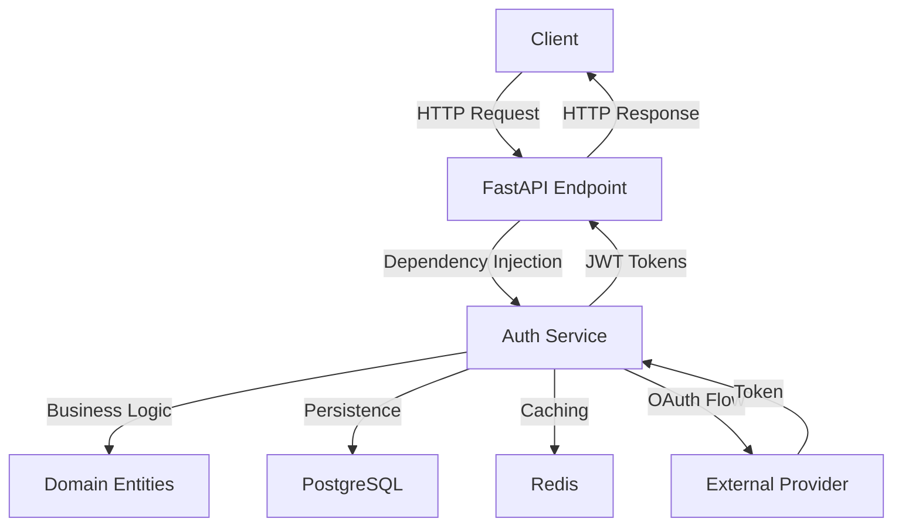

# Cedrina Authentication System: Comprehensive Documentation

## Introduction

The Cedrina Authentication System is a robust, secure, and scalable solution designed for modern web applications. Built with FastAPI, SQLModel, and PostgreSQL, it provides a full-featured authentication framework supporting username/password authentication, OAuth 2.0 integration with external providers (Google, Microsoft, Facebook), and JWT-based session management. This document offers an in-depth exploration of the system's architecture, components, security mechanisms, design principles, and operational guidelines.

The system adheres to best practices in software engineering, including SOLID principles, Domain-Driven Design (DDD), and Clean Architecture, ensuring modularity, testability, and maintainability. It is engineered to meet enterprise-grade requirements with features like RS256 JWT signing, bcrypt password hashing, pgcrypto token encryption, rate limiting, and structured logging.

## Objectives

- **Security**: Implement robust mechanisms to protect user data and prevent unauthorized access.
- **Scalability**: Design for high performance under load with async operations and caching.
- **Modularity**: Enable easy extension for new authentication providers or features.
- **User Experience**: Provide seamless authentication flows for end-users.
- **Maintainability**: Ensure clean, well-documented code with comprehensive tests.

## System Architecture

The Cedrina Authentication System follows a layered architecture inspired by Clean Architecture and DDD, separating concerns into distinct layers:

- **Domain Layer** (`src/domain/`): Contains core business logic, entities (`User`, `OAuthProfile`, `Session`), and services (`UserAuthenticationService`, `OAuthService`, `TokenService`, `SessionService`). This layer is independent of external frameworks or infrastructure.
- **Adapter Layer** (`src/adapters/`): Bridges the domain to external systems, including API endpoints (`src/adapters/api/v1/auth/`) for FastAPI routes and dependency injection.
- **Infrastructure Layer** (`src/infrastructure/`): Manages database connections (PostgreSQL via SQLModel), Redis caching, and environment configurations.
- **Core Layer** (`src/core/`): Provides shared utilities, configurations (`settings.py`), and custom exceptions.

This separation ensures that changes in one layer (e.g., API framework) do not affect the core business logic, enhancing adaptability and testability.

### Architectural Diagram

Below is a conceptual flow of the authentication system:



## Key Components

### 1. Domain Entities (Models)

Defined in `src/domain/entities/`, these models represent core data structures mapped to PostgreSQL tables using SQLModel, which combines SQLAlchemy for ORM and Pydantic for validation.

- **User** (`user.py`): Represents a user with fields like `id`, `username`, `email`, `hashed_password`, `role`, and `is_active`. Supports both local and OAuth authentication.
  - Table: `users`
  - Constraints: Unique `username` and `email`, indexes for case-insensitive searches.
- **OAuthProfile** (`oauth_profile.py`): Links users to OAuth providers, storing encrypted access tokens.
  - Table: `oauth_profiles`
  - Fields: `provider`, `provider_user_id`, `access_token` (encrypted with pgcrypto).
- **Session** (`session.py`): Tracks JWT refresh tokens for session management.
  - Table: `sessions`
  - Fields: `jti` (JWT ID), `refresh_token_hash`, `revoked_at` for revocation.

### 2. Authentication Services

Located in `src/domain/services/auth/`, these services encapsulate business logic for authentication processes.

- **UserAuthenticationService** (`user_authentication.py`): Handles username/password authentication and user registration.
  - Methods: `authenticate_by_credentials`, `register_user`.
  - Security: Bcrypt hashing, password policy enforcement.
- **OAuthService** (`oauth.py`): Manages OAuth 2.0 flows for external providers.
  - Methods: `authenticate_with_oauth`, `_fetch_user_info` with retry logic.
  - Security: Token encryption, CSRF state validation placeholder.
- **TokenService** (`token.py`): Issues and validates JWT tokens.
  - Methods: `create_access_token`, `create_refresh_token`, `refresh_tokens`, `validate_token`.
  - Security: RS256 signing, token rotation, Redis/PostgreSQL storage.
- **SessionService** (`session.py`): Manages session creation and revocation.
  - Methods: `create_session`, `revoke_session`, `is_session_valid`.

### 3. API Endpoints

Defined in `src/adapters/api/v1/auth/routes/`, these FastAPI routes expose authentication functionality:

- **Register** (`register.py`): `POST /api/v1/auth/register` - Creates a new user and issues tokens.
- **Login** (`login.py`): `POST /api/v1/auth/login` - Authenticates a user and issues tokens.
- **OAuth** (`oauth.py`): `POST /api/v1/auth/oauth` - Handles OAuth authentication and token issuance.
- **Change Password** (`change_password.py`): `POST /api/v1/auth/change-password` - Allows authenticated users to update their password.
- **Logout** (`logout.py`): `DELETE /api/v1/auth/logout` - Revokes the user's tokens and removes the session.

### 4. Schemas


Pydantic models in `src/adapters/api/v1/auth/schemas/` define request and response structures:

- **Requests**: `RegisterRequest`, `LoginRequest`, `OAuthAuthenticateRequest`, `ChangePasswordRequest`.
- **Responses**: `UserOut`, `TokenPair`, `AuthResponse`, `OAuthAuthResponse`. The `TokenPair` model now includes an `expires_in` field to indicate the expiration time of the access token in seconds.

### 5. Dependencies

Dependency injection in `src/adapters/api/v1/auth/dependencies.py` provides service instances to endpoints, ensuring loose coupling.

## Security Mechanisms

The system incorporates multiple layers of security to protect against common vulnerabilities:

- **Password Hashing**: Bcrypt via `passlib` for secure storage.
- **JWT Signing**: RS256 (RSA with SHA-256) using asymmetric keys for token integrity.
- **Token Encryption**: OAuth access tokens encrypted with `pgcrypto` in PostgreSQL.
- **Token Rotation**: Refresh tokens are single-use, rotated on refresh to prevent reuse.
- **Rate Limiting**: Configured to limit login and registration attempts, preventing brute force attacks.
- **Session Management**: Sessions tracked in PostgreSQL and Redis, with revocation support.
- **Input Validation**: Pydantic ensures strict validation of API inputs.
- **Exception Handling**: Custom exceptions (`AuthenticationError`, `DuplicateUserError`) provide detailed error messages.

## Design Principles

- **SOLID Principles**:
  - **Single Responsibility**: Each service and endpoint has a focused role.
  - **Open/Closed**: Extensible for new OAuth providers without modifying core logic.
  - **Dependency Inversion**: Services depend on abstractions (injected dependencies).
- **Domain-Driven Design**: Core logic resides in the domain layer, reflecting business concepts.
- **Clean Architecture**: Separation of concerns with clear boundaries between layers.
- **Async Performance**: All database and service operations are asynchronous for scalability.
- **Type Safety**: Strict typing with MyPy compliance.

## Testing Strategy

Comprehensive tests ensure reliability and correctness:

- **Unit Tests**: Cover individual service methods (`tests/unit/services/auth/`).
- **Integration Tests**: Validate API endpoints and service interactions (`tests/integration/`).
- **Edge Cases**: Test invalid inputs, expired tokens, and error conditions.
- **Coverage**: High coverage enforced with `pytest --cov`.

Tests are located in `tests/unit/adapters/api/auth/` for API endpoints, using mocked services to isolate dependencies.

## Setup and Configuration

### Environment Variables

Defined in `.env.development`, key settings include:

- `DATABASE_URL`: PostgreSQL connection string.
- `REDIS_URL`: Redis connection for caching and rate limiting.
- `PGCRYPTO_KEY`: Encryption key for OAuth tokens.
- `JWT_PRIVATE_KEY`, `JWT_PUBLIC_KEY`: RSA keys for JWT signing.
- OAuth credentials (`GOOGLE_CLIENT_ID`, `MICROSOFT_CLIENT_SECRET`, etc.).

### Database Migrations

Alembic manages schema changes, auto-applied in Docker environments via `entrypoint.sh`.

### Verification Commands

- Check tables: `docker exec cedrina_postgres_1 psql -U postgres -d cedrina_dev -c "\dt"`
- Test encryption: `docker exec cedrina_postgres_1 psql -U postgres -d cedrina_dev -c "SELECT pgp_sym_encrypt('test_token', '$PGCRYPTO_KEY') AS encrypted;"`
- Redis keys: `docker exec cedrina_redis_1 redis-cli KEYS "refresh_token:*"`

## Usage Examples

### User Registration

```bash
curl -X POST http://localhost:8000/api/v1/auth/register -H "Content-Type: application/json" -d '{"username": "testuser", "email": "test@example.com", "password": "StrongPass123"}'
```

Response:
```json
{
  "user": { "id": 1, "username": "testuser", "email": "test@example.com", "is_active": true, "created_at": "2025-06-16T12:00:00", "roles": ["user"] },
  "tokens": { "access_token": "eyJ...", "refresh_token": "eyJ...", "token_type": "Bearer", "expires_in": 1800 }
}
```


### User Login

```bash
curl -X POST http://localhost:8000/api/v1/auth/login -H "Content-Type: application/json" -d '{"username": "testuser", "password": "StrongPass123"}'
```

Response:
```json
{
  "user": { "id": 1, "username": "testuser", "email": "test@example.com", "is_active": true, "created_at": "2025-06-16T12:00:00", "roles": ["user"] },
  "tokens": { "access_token": "eyJ...", "refresh_token": "eyJ...", "token_type": "Bearer", "expires_in": 1800 }
}
```

### Change Password

```bash
curl -X POST http://localhost:8000/api/v1/auth/change-password \
  -H "Authorization: Bearer <access-token>" \
  -H "Content-Type: application/json" \
  -d '{"current_password": "Oldpass123!", "new_password": "Newpass123!"}'
```

Response:
```json
{
  "message": "Password successfully changed"
}
```

### OAuth Authentication

```bash
curl -X POST http://localhost:8000/api/v1/auth/oauth -H "Content-Type: application/json" -d '{"provider": "google", "token": {"access_token": "oauth_token", "expires_at": 9999999999}}'
```

Response:
```json
{
  "user": { "id": 1, "username": "testuser", "email": "test@example.com", "is_active": true, "created_at": "2025-06-16T12:00:00", "roles": ["user"] },
  "tokens": { "access_token": "eyJ...", "refresh_token": "eyJ...", "token_type": "Bearer", "expires_in": 1800 }
}
```

## Troubleshooting

- **Authentication Failures**: Check logs (`docker logs cedrina_app_1`) for detailed errors on credentials or tokens.
- **Rate Limit Errors**: Wait 60 seconds or clear Redis (`docker exec cedrina_redis_1 redis-cli FLUSHDB`).
- **OAuth Issues**: Verify client IDs and secrets in `.env.development` match provider console settings.
- **Database Issues**: Ensure migrations ran (`docker logs cedrina_app_1`) and tables exist.

## Future Enhancements

- **Additional OAuth Providers**: Extend `OAuthService` for GitHub, Twitter, etc.
- **Token Blacklisting**: Implement `_is_token_blacklisted` in `TokenService` for immediate revocation.
- **Two-Factor Authentication**: Add support for 2FA via email or SMS.
- **Password Reset**: Implement endpoints for password recovery flows.

## Conclusion

The Cedrina Authentication System is a state-of-the-art solution for secure user authentication, blending modern technologies (FastAPI, SQLModel, JWT) with rigorous security practices (RS256, bcrypt, pgcrypto). Its modular design and comprehensive testing ensure it can scale with application needs while maintaining high security standards. This documentation provides a foundation for developers to understand, operate, and extend the system as required. 
